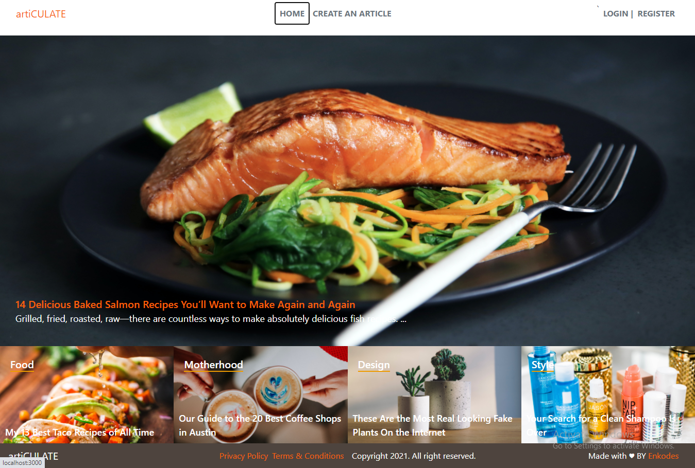

# artiCULATE ROR Capstone project

> This project is based on a lifestyle articles website and is for Ruby on Rails capstone at Microverse. I have followed the given design, and I chose to develop this app for articles on women's lifestyles with 'Ruby on Rails". A new article can be created under one or multiple categories. You can upvote an article. The most voted article will be displayed on the home page's top section.



## Built With

- Ruby v2.7.0
- Ruby on Rails 6.0.3
- Bootstrap 4
- Rspec
- Capybara
- rubocop
- heroku


## Live Demo

[artiCULATE](https://articulate-app.herokuapp.com/)

## Video Link

[Loom Presentation](https://www.loom.com/share/aa1932ca07f04be1bb957e5de936cba1)

## Getting Started

To get a local copy up and running follow these simple example steps.

### Prerequisites

Ruby: 2.7.0
Rails: 6.0.3

**Setup**

- Clone this repository with `https://github.com/enkog/Lifestyle_app.git` using your terminal or command line.<br>
- Change to the project directory by entering `cd Lifestyle_app` in the terminal<br>
- Next run `bundle install` to install the necessary dependencies<br>
- run rails `active_storage:install`
- run `rails db:create`
- Run `rails db:migrate` to setup your local database.<br>
- Run `rails db:seed` to get seeded data for project.<br>
- Finally run `rails console` to start the application.<br>

### Usage

Start server with:

```
    rails s
```

Open `http://localhost:3000/` in your browser.

### Run tests

> for test formatting add below script in .rspec file

```
    rpsec --format documentation
```

> To run all the tests run below script in the terminal

`rspec`

## Author

👤 **Oguadinma Nkiruka Ngozika**

-   Github: [@enkog](https://github.com/enkog)
-   Linkedin: [@enkog](https://www.linkedin.com/in/enkog/)
-   Twitter: [@enkodes](https://twitter.com/enkodes)

## 🤝 Contributing

Contributions, issues and feature requests are welcome!

Feel free to check the [issues page](issues/).

## Show your support

Give a ⭐️ if you like this project!

## Acknowledgments

> [https://www.behance.net/gallery/14554909/liFEsTlye-Mobile-version](https://www.behance.net/gallery/14554909/liFEsTlye-Mobile-version)

> Design idea by [Nelson Sakwa on Behance](https://www.behance.net/sakwadesignstudio)

> Stock images from unsplash.com

> Article content ideas from https://camillestyles.com/


## 📝 License
